<div align="center">

# 🎬 Social Media Content System

**Turn your raw video library into polished short-form reels and publish them to Instagram, TikTok and YouTube Shorts automatically.**

Self-hosted · AI-assisted · Niche-agnostic · MIT licensed

[](https://omrapp.github.io/social-media-content-system/)


</div>

---

## Contents

- [Live demo](#-live-demo)
- [Screenshots](#-screenshots)
- [Features](#-features)
- [How it works](#-how-it-works)
- [Tech stack](#-tech-stack)
- [Installation](#-installation)
- [Configuration](#-configuration)
- [Using the app](#-using-the-app)
- [Pipeline scripts (CLI)](#-pipeline-scripts-cli)
- [Telegram bot](#-telegram-bot-optional)
- [Deployment](#-deployment)
- [Project structure](#-project-structure)
- [Testing](#-testing)
- [Maintenance](#-maintenance)
- [Contributing](#-contributing)
- [License](#-license)

---

## 🚀 Live demo

**👉 [omrapp.github.io/social-media-content-system](https://omrapp.github.io/social-media-content-system/)**

The demo is the real frontend running in **demo mode**: no backend or account,
just sample data in memory. Click **Admin** on the landing page to go straight
into the dashboard. Approving posts, saving settings and similar actions update
the in-memory state. Rendering, AI calls and publishing are only simulated.

Run the same demo locally in one command:

```bash
cd frontend && npm install && VITE_DEMO_MODE=true npm run dev
# → http://localhost:5173
```

---

## 📸 Screenshots

| Library | Create (single or merge) |
|---|---|
| 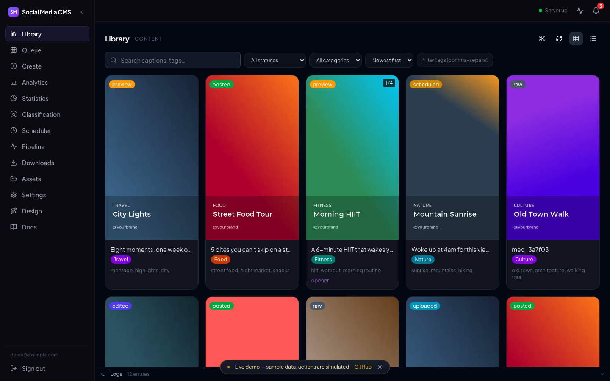 | 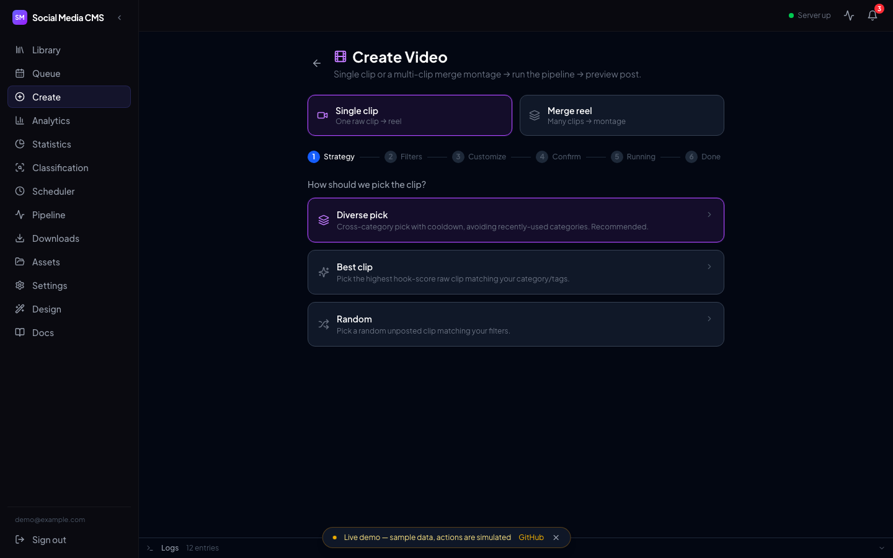 |
| **Approval queue** | **Reel preview** |
| 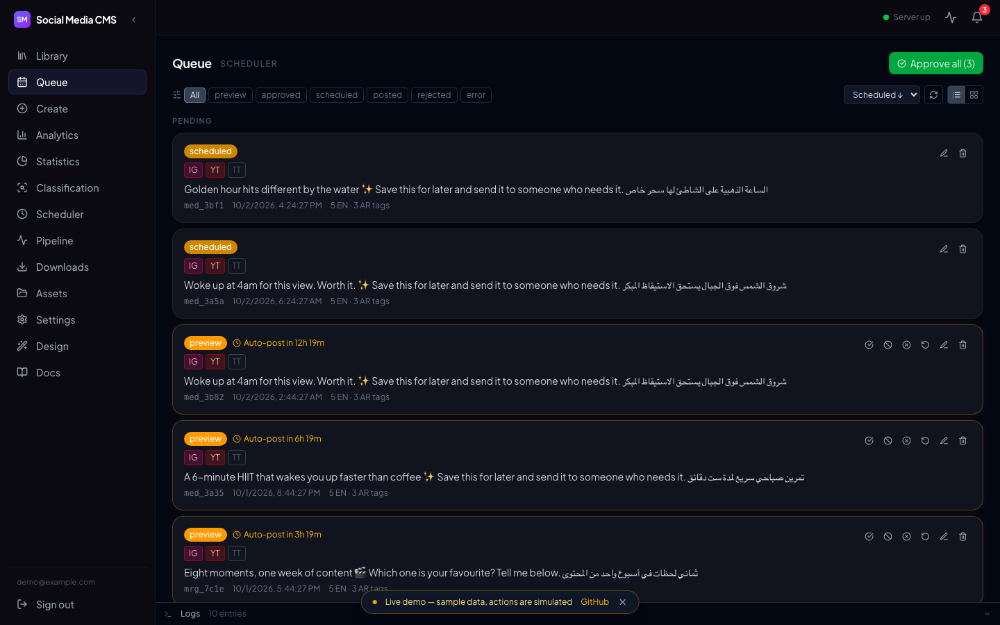 | 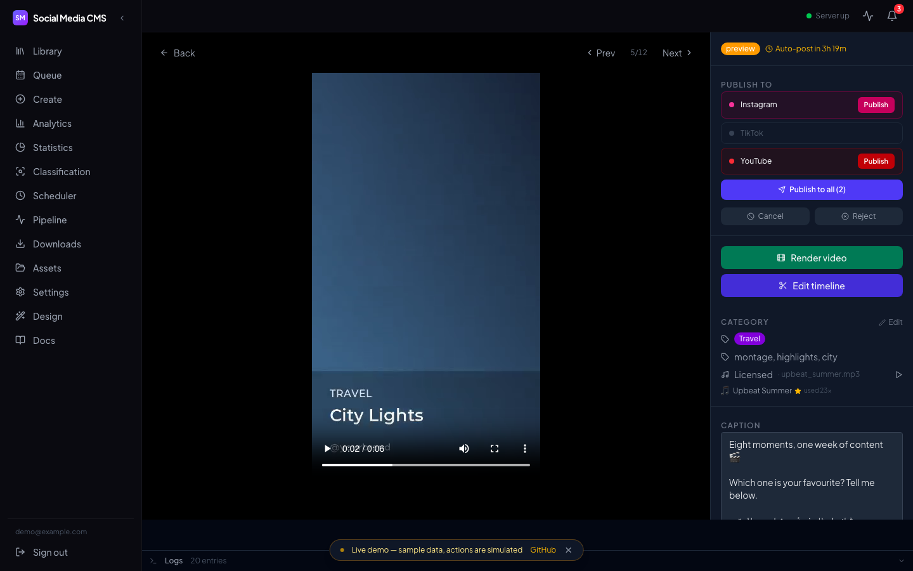 |
| **Timeline editor** | **Analytics** |
| 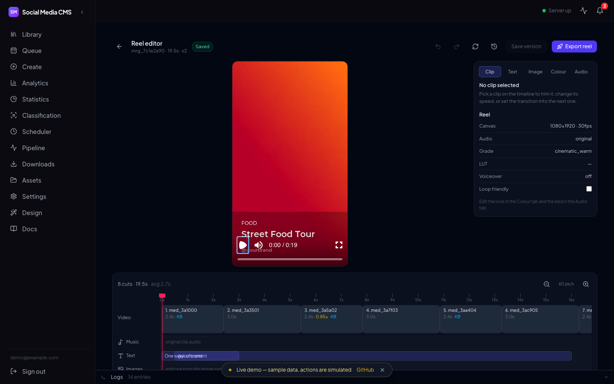 | 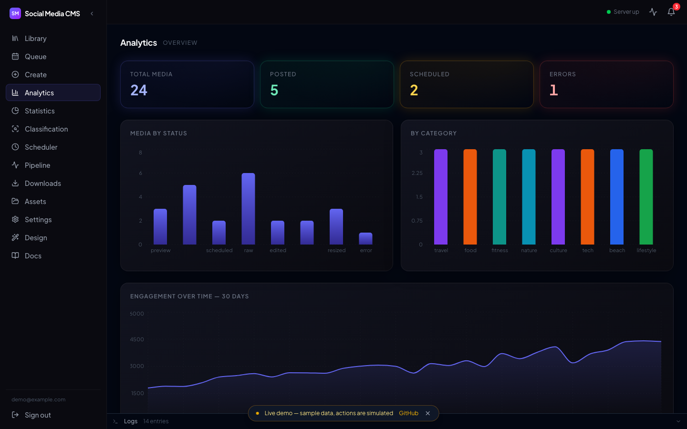 |
| **Assets (music · fonts · LUTs · intros · outros)** | **Settings** |
| 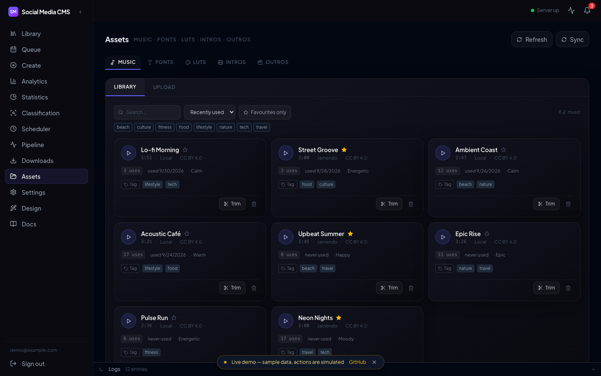 | 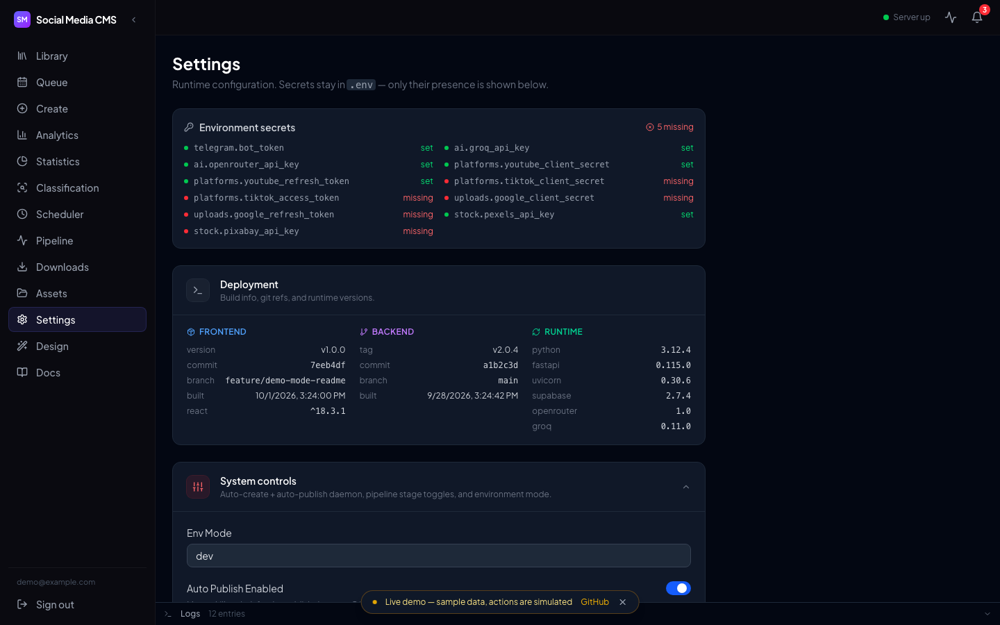 |
| **Downloads & imports** | **Design (branding · intro · cast screens)** |
| 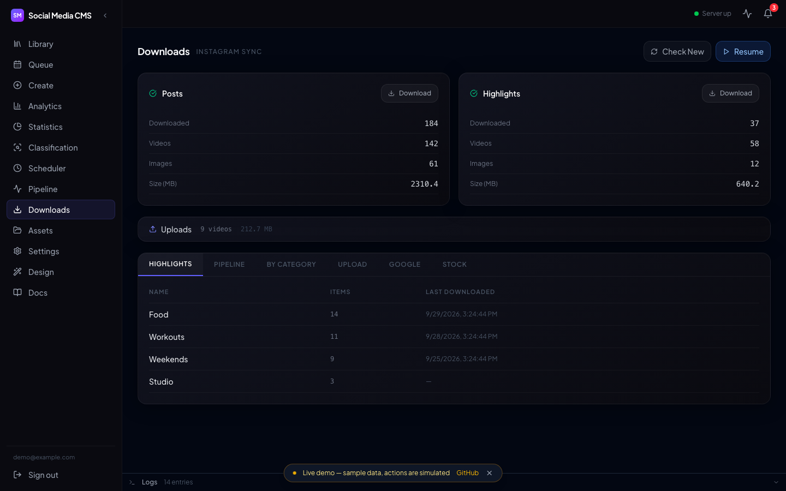 | 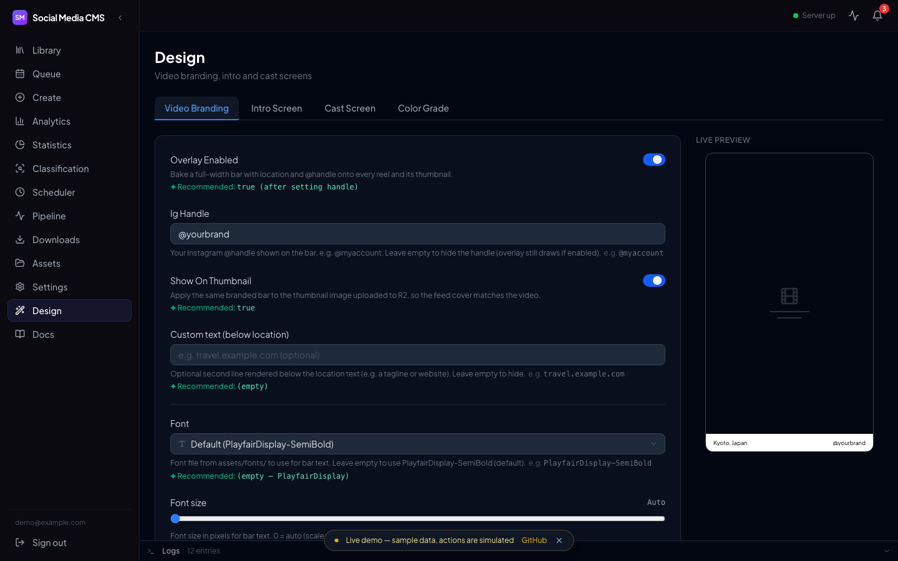 |

<details>
<summary><b>More: landing page, pipeline, scheduler, statistics</b></summary>

| Landing | Pipeline |
|---|---|
| 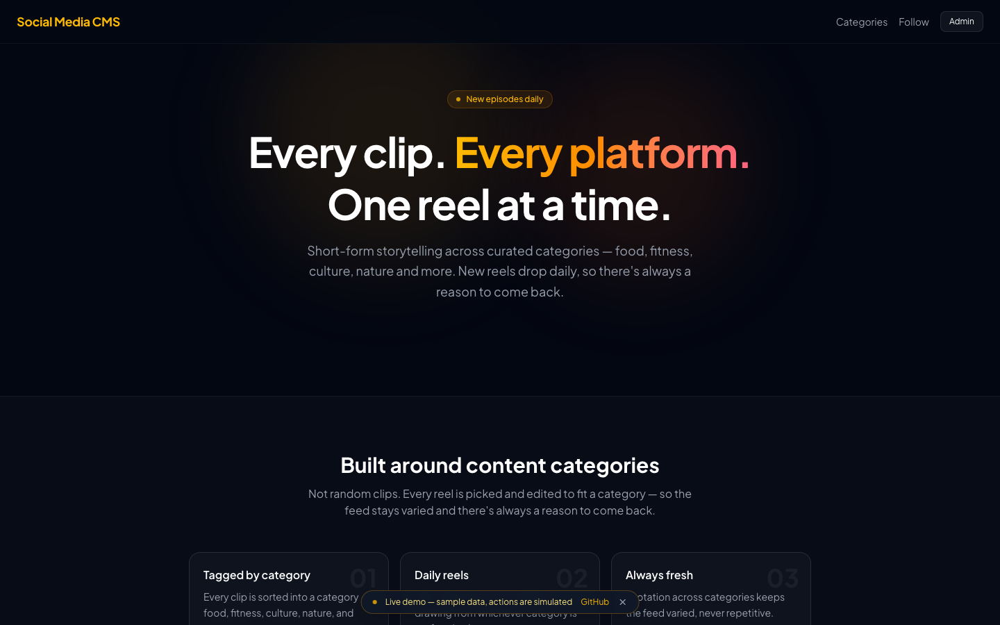 | 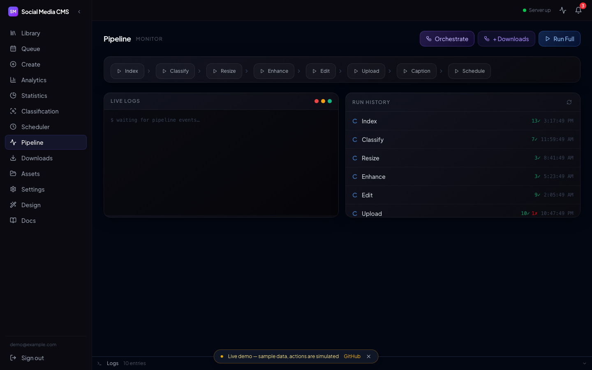 |
| **Scheduler** | **Statistics** |
| 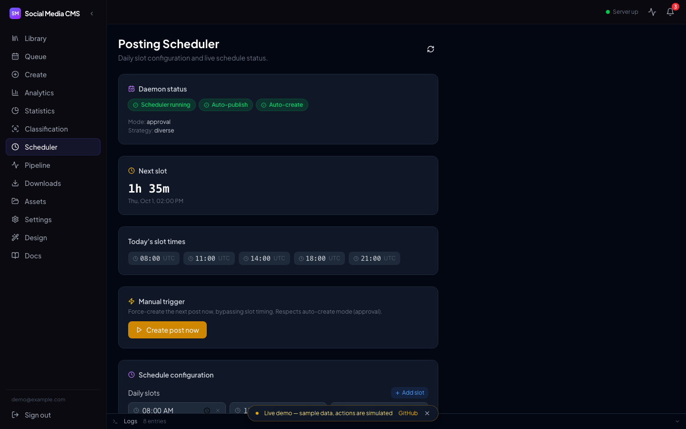 | 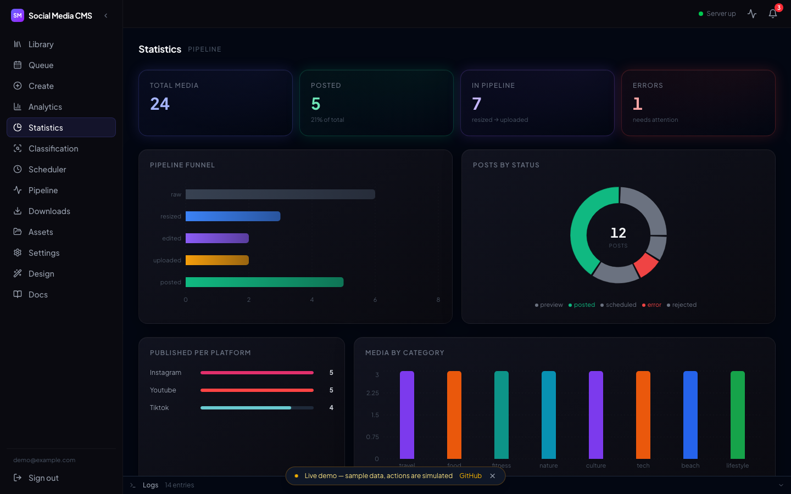 |

</details>

<details>
<summary><b>Animated: reel editor</b></summary>


</details>

> All screenshots come from the live demo, which uses sample data. The demo
> clips are synthetic gradients generated with FFmpeg.

---

## ✨ Features

**📥 Ingest from anywhere**
- Drag-and-drop uploads, paste a Drive/Dropbox/direct URL (SSRF-guarded), Google Drive & Google Photos picker, Instagram archive + Highlights
- Optional royalty-free B-roll search and import from **Pexels** / **Pixabay**
- Everything is indexed into one library with `category` + freeform `tags`, so no niche is assumed

**🧠 AI that does the boring parts**
- Auto-classifies clips (category, tags) with **Groq** and scores each clip's "hook" with a vision model (Groq, or a local **Ollama/Moondream** fallback)
- Writes bilingual **EN + AR captions**, hashtags and alt text, with Groq first and OpenRouter as fallback. Optional trend injection, a hook library, self-critique and hashtag A/B tests
- Natural-language edit requests ("swap the music, make it warmer") get routed to pipeline stages via tool-use

**🎞️ Real video editing (FFmpeg)**
- Single-clip reels: smart 9:16 crop, denoise, sharpen, LUT color grading, branded bar, intro/outro cards
- **Cinematic montages**: 20+ beat-synced cuts from 10+ source videos, Ken Burns, slow-mo, varied transitions, film grade, grain and vignette, plus a mood-matched music bed
- Optional extras: burned-in caption removal (YOLO11 + inpainting), **edge-tts voiceover** with word-synced subtitles
- **Browser timeline editor** (Remotion player + drag-and-drop) for cuts, text and image layers, color and audio. Exports re-render on the server

**📅 Publish on autopilot**
- Scheduled to **Instagram Reels, TikTok and YouTube Shorts** from configurable daily slots, with times ordered by your best-performing hours
- Approval gate: auto-publish after N minutes, or require manual approval per category
- Live WebSocket countdowns, retry handling, never posts the same media twice

**📊 Close the loop**
- Analytics per category and over time. Top-performing hooks feed back into new captions
- Optional **Telegram bot**: preview pushes, one-tap approve/reject/reschedule, `/create` wizard from your phone

---

## 🧩 How it works

### Architecture

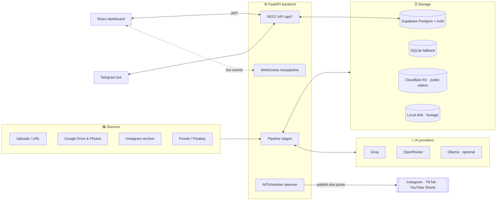

### Content pipeline

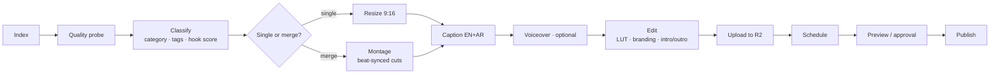

### Media lifecycle

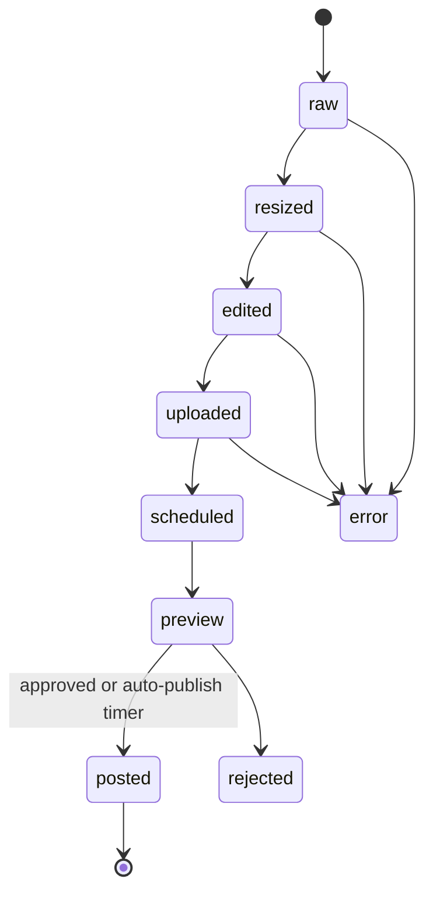

### Approval flow

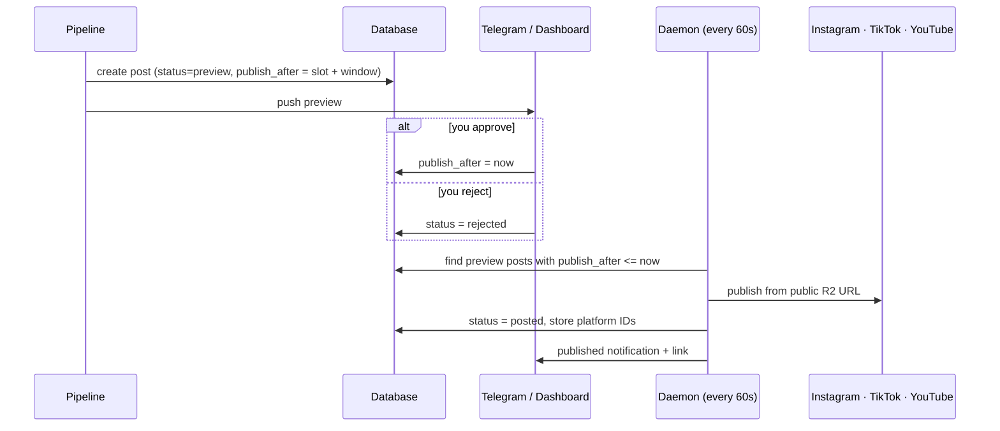

---

## 🛠 Tech stack

| Layer | Technology | Version |
|---|---|---|
| **Frontend** | React · React DOM | 18.3 |
| | TypeScript | 5.5 |
| | Vite | 5.4 |
| | Tailwind CSS · shadcn/ui (Radix) | 4.0 |
| | TanStack Query | 5.x |
| | React Router | 6.26 |
| | Remotion Player (editor preview) | 4.0 |
| | dnd-kit (timeline) | 6.3 |
| | Framer Motion (animations) | 12.x |
| | Recharts (analytics) | 2.12 |
| | Supabase JS (auth) | 2.45 |
| **Backend** | Python | 3.12 |
| | FastAPI · Uvicorn | 0.136 · 0.48 |
| | Pydantic | 2.13 |
| | APScheduler | 3.11 |
| | supabase-py | 2.30 |
| | boto3 (Cloudflare R2) | 1.43 |
| | groq · openai SDKs | 1.4 · 3.1 |
| | OpenCV · PySceneDetect · librosa | 5.0 · latest · latest |
| | ONNX Runtime (caption removal) | 1.23 |
| | edge-tts (voiceover) | latest |
| **Media** | FFmpeg (+ libvidstab) | 7+ |
| **Data** | Supabase (Postgres + Auth + RLS) / SQLite fallback | — |
| **Storage** | Cloudflare R2 (S3-compatible) | — |
| **AI** | Groq `openai/gpt-oss-120b`, OpenRouter, Ollama Moondream (optional) | — |
| **Infra** | Docker · Docker Compose · Caddy · systemd · GitHub Actions · Vercel / GitHub Pages | — |

---

## 📦 Installation

### Prerequisites

| Requirement | Needed for | Required? |
|---|---|---|
| Python 3.12+ | backend | ✅ |
| Node.js 20+ (22 recommended) | frontend | ✅ |
| FFmpeg 7+ (with `libvidstab`) | all video processing | ✅ |
| Supabase project | database + login (SQLite works for local trials) | ✅ for prod |
| Cloudflare R2 bucket (public) | platforms pull videos from a public URL | ✅ to publish |
| Groq API key (free tier) | classification + captions | ✅ |
| OpenRouter API key | caption fallback / refine | recommended |
| Meta developer app + IG Business/Creator account | Instagram publishing | optional |
| YouTube / TikTok developer credentials | Shorts / TikTok publishing | optional |
| Telegram bot token | mobile approvals | optional |
| Pexels / Pixabay keys | stock B-roll + music search | optional |

Every optional integration has its own settings toggle. The app runs without them.

### 0. Just want to look around?

Use the [live demo](https://omrapp.github.io/social-media-content-system/), or
run `VITE_DEMO_MODE=true npm run dev` inside `frontend/`. You don't need a
backend or any keys for that.

### 1. Clone

```bash
git clone https://github.com/omrapp/social-media-content-system.git
cd social-media-content-system
```

### 2. Backend

```bash
python3.12 -m venv .venv
source .venv/bin/activate            # Windows: .venv\Scripts\activate
pip install -r requirements.txt
cp .env.example .env                 # then fill in the values (see Configuration)
```

Check that FFmpeg is installed: `ffmpeg -version`. On macOS run `brew install ffmpeg`;
on Debian/Ubuntu run `sudo apt install ffmpeg`.

### 3. Database

```bash
# With the Supabase CLI
supabase login
supabase link --project-ref <YOUR_PROJECT_REF>
supabase db push
```

No CLI? Run each file in `supabase/migrations/` **in order** in the Supabase SQL
editor. If you leave `SUPABASE_URL` / `SUPABASE_KEY` empty, the backend uses
a local SQLite file (`content.db`). That's fine for a trial, not for production.

Create your login user under Supabase → **Authentication → Users → Add user**.

### 4. Frontend

```bash
cd frontend
npm install
cp .env.example .env       # set VITE_SUPABASE_URL + VITE_SUPABASE_ANON_KEY
cd ..
```

### 5. Run

```bash
# Terminal 1 — API. Must be a single worker (APScheduler).
uvicorn backend.api.main:app --reload --workers 1 --port 8000

# Terminal 2 — dashboard
cd frontend && npm run dev            # → http://localhost:5173
```

In dev, Vite proxies `/api`, `/static` and `/ws` to `localhost:8000`, so leave
`VITE_API_BASE_URL` empty.

### 6. Verify

```bash
curl http://localhost:8000/api/health         # {"status":"ok", ...}
python -m backend.pipeline.index_content      # runs cleanly on an empty library
```

Log in at `http://localhost:5173/login`. The **Library** page should load, and
the server badge in the sidebar should be green.

### Docker (alternative)

```bash
docker compose up -d api              # FFmpeg + all deps baked in, binds 127.0.0.1:8000
```

`docker-compose.yml` also defines an optional `ollama` sidecar for the nightly
local vision scoring. See [`docs/OLLAMA_INSTALLATION.md`](docs/OLLAMA_INSTALLATION.md).

### Optional one-time setups

| Feature | Setup |
|---|---|
| Caption/watermark removal | `python backend/scripts/setup_decaption.py` + the SQL in [`docs/REFERENCE.md`](docs/REFERENCE.md) |
| Voiceover | apply the `voiceover_*` columns migration (see reference) |
| Reel editor LUT preview | `python -m backend.scripts.make_lut_previews` |
| YouTube | `python -m backend.scripts.auth_youtube` → refresh token |
| TikTok | `python -m backend.scripts.auth_tiktok` → tokens |
| Google Drive/Photos import | `python -m backend.scripts.auth_google` → refresh token |

---

## ⚙️ Configuration

There are two layers:

1. **Secrets and infrastructure** go in `.env` (backend) and `frontend/.env`.
   [`.env.example`](.env.example) and [`frontend/.env.example`](frontend/.env.example)
   list and annotate every variable. Secrets never go in the database or in
   `VITE_*` variables.
2. **Behavior** is set on the **Settings** page and stored in the database.
   Examples: daily posting slots, timezone, approval window, AI models,
   caption style, hashtag pools, merge/montage tuning, video quality, intro/cast
   screens, branding. The [settings reference](docs/REFERENCE.md#settings-keys)
   lists every key and its default.

Frontend branding variables for your public pages:

```bash
VITE_APP_NAME="My Studio"
VITE_OPERATOR_NAME="Jane Doe"
VITE_CONTACT_EMAIL=hello@example.com
VITE_INSTAGRAM_URL=https://instagram.com/yourhandle   # leave empty to hide
VITE_YOUTUBE_URL=
VITE_TIKTOK_URL=
```

Backend CORS for your production frontend domain:

```bash
CORS_ORIGINS=https://app.example.com,https://www.app.example.com
```

---

## 🧭 Using the app

1. **Bring in footage** on the **Downloads** page: upload files, paste a link,
   pick from Google Drive/Photos, or import stock B-roll. Set a category and
   optional tags.
2. **Classify.** New clips get a category, tags and a hook score automatically
   (or run it from **Pipeline**). Review the results on the **Classification** page.
3. **Customize the look** on the **Design** page (branding bar, intro card,
   cast/outro card) and the **Assets** page (music, fonts, LUTs, intros, outros).
4. **Create a reel** on the **Create** page:
   - *Single*: pick filters, preview the chosen clip, re-pick if you like it less,
     then choose music and a LUT.
   - *Merge*: pick a category or tags and get a beat-synced montage from many
     clips.
5. **Fine-tune** in the **Preview** page (caption, details, AI edit requests) or
   the **timeline editor** (cuts, text, stickers, color, audio). Then export.
6. **Approve** on the **Queue** page (or in Telegram). Posts auto-publish when
   their window ends unless the category needs manual approval.
7. **Learn** from the **Analytics** and **Statistics** pages. Top hooks and best
   posting times feed back into the next captions and schedule automatically.

---

## 🖥 Pipeline scripts (CLI)

You can also run every stage by hand, for backfills or debugging:

```bash
python -m backend.pipeline.index_content                       # idempotent
python -m backend.pipeline.classify_groq                       # category + tags
python -m backend.pipeline.classify_vision --provider local --limit 50
python -m backend.pipeline.caption_gen --category food --tags "street-food,budget"
python -m backend.pipeline.caption_gen --media-id <id> --mode refine --feedback "shorter"
python -m backend.pipeline.quality_probe --backfill
python -m backend.pipeline.flag_unusable --dry-run
python -m backend.pipeline.orchestrator --stages index,classify,resize,caption,upload
```

The full list of scripts, the API (50+ endpoints) and the settings keys are in
[`docs/REFERENCE.md`](docs/REFERENCE.md).

---

## 🤖 Telegram bot (optional)

```bash
# .env
TELEGRAM_BOT_TOKEN=...
TELEGRAM_CHAT_ID=...
TELEGRAM_MODE=poll          # dev; use "webhook" in production
```

Register the production webhook once:

```bash
curl "https://api.telegram.org/bot<TOKEN>/setWebhook?url=https://<your-domain>/api/telegram/webhook/<TELEGRAM_WEBHOOK_SECRET>"
```

| Command | What it does |
|---|---|
| `/queue` | upcoming scheduled posts |
| `/pending` | posts awaiting approval |
| `/stats` | media counts |
| `/settings` | settings summary |
| `/create` | wizard: category → tags → confirm → pipeline → preview |
| `/help` | command list |

Preview messages have inline buttons: publish per platform, approve all, edit
caption, details, reschedule, regenerate, cancel, reject.

---

## ☁️ Deployment

| Piece | Option | Files |
|---|---|---|
| Backend | Docker on any VPS behind Caddy | `Dockerfile`, `docker-compose.yml`, `deploy/` |
| Backend CI | tag `vX.Y.Z` on `release/*` → GHCR image → SSH deploy (auto-rollback on failure) | `.github/workflows/release.yml` |
| Frontend | Vercel (tag `fe-vX.Y.Z` on `release/frontend/*`) or any static host | `.github/workflows/frontend-release.yml` |
| Live demo | GitHub Pages, built on every push to `main` | `.github/workflows/demo-pages.yml` |

First-time server prep:

```bash
mkdir -p /srv/social-media-cms/{data,assets,db,backups,reels,logs}
cp .env /srv/social-media-cms/.env
# add deploy/caddy-social-media-cms.snippet to your Caddyfile, reload Caddy
cp deploy/social-media-cms.service /etc/systemd/system/
systemctl enable --now social-media-cms
```

The CI workflows need repository secrets (SSH host/key, GHCR token, Vercel
tokens). The [list is in the reference](docs/REFERENCE.md#github-secrets-required).
You don't have to use CI: `uvicorn` plus any static host works fine.

---

## 🗂 Project structure

```
backend/
  api/            FastAPI app, auth, WebSocket, routes (media, posts, editor, settings, …)
  pipeline/       index, classify, caption, resize, merge, edit, voiceover, publish, daemon, telegram
  scripts/        one-time OAuth helpers, LUT previews, token refresh
  vendor/vtr/     vendored caption-removal model wrapper
frontend/
  src/pages/      Library, Create, Queue, Preview, Editor, Analytics, Assets, Settings, …
  src/components/ pickers, panels, editor timeline + inspectors
  src/demo/       demo-mode fixtures (powers the live preview)
remotion/         Remotion compositions
assets/           music/, luts/, fonts/ (open-licensed only), stickers/, templates/
supabase/         migrations (apply in order) + edge functions
deploy/           Caddy snippet, systemd unit, deploy/rollback/vision scripts
docs/             REFERENCE.md, OLLAMA_INSTALLATION.md, screenshots/
tests/            pytest suite (API, pipeline, golden FFmpeg argv fixtures)
```

---

## 🧪 Testing

```bash
pytest                                   # backend
cd frontend && npx tsc --noEmit          # frontend type-check
```

The merge renderer has golden fixtures. Refresh them with `pytest --update-golden`
(see `tests/README_merge_golden.md`).

---

## 🔧 Maintenance

- **Instagram token** expires every 60 days. Refresh it via Meta's token endpoint
  and update `IG_TOKEN`. The dashboard shows a banner before it expires.
- **TikTok access token** expires every 24h. Put
  `python -m backend.scripts.refresh_tiktok_token` on a cron job.
- **Music and LUTs**: drop files into `assets/music/` or `assets/luts/` and
  they're picked up automatically. The repo ships only three basic LUTs
  (`warm`/`cool`/`vintage`) because third-party packs can't be redistributed.
  Put your own `.cube` files in `assets/luts/cinematic/`. `assets/luts/catalog.json`
  tags the ones whose filenames match.
- **Fonts**: only open-licensed fonts (OFL/Apache/GPL-FE) ship with the repo.
  Add your own to `assets/fonts/`.

---

## 🤝 Contributing

Issues and PRs are welcome.

1. Fork the repo and branch from `develop` (`feature/…` or `fix/…`)
2. Keep changes focused. Run `pytest` and `npx tsc --noEmit` before pushing
3. Add new user-tunable behavior as a setting with a safe default, and document
   it in `docs/REFERENCE.md` and `RELEASE_NOTES.md`
4. Open a PR against `develop`

Found a security issue? Please use GitHub's **private vulnerability reporting**
(Security tab), not a public issue.

---

## 📄 License

[MIT](LICENSE). You can use it, fork it and build on it.
